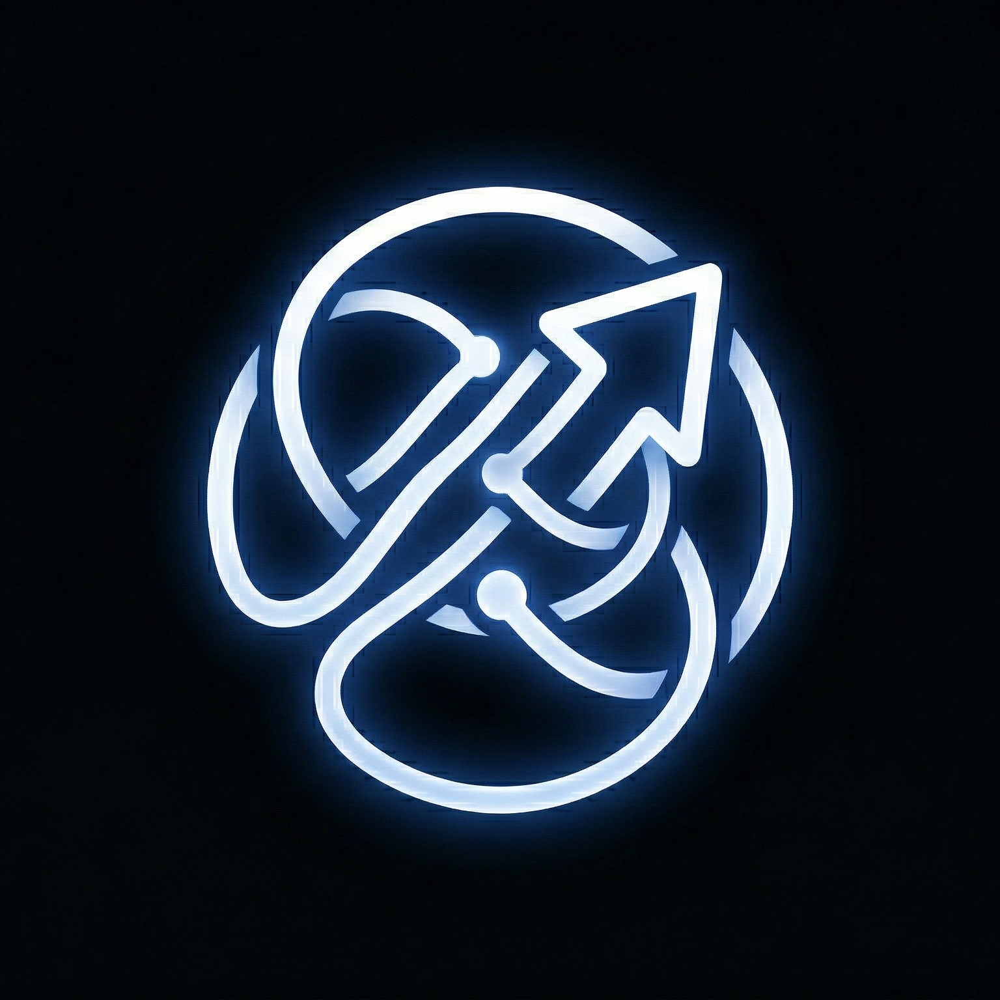

<div align="center">



# Photonic Recall

### text a name. get a cheat sheet before you see them.

[](https://bun.sh)
[](https://www.npmjs.com/package/@photon-ai/imessage-kit)
[](https://ai.google.dev)
[](https://www.typescriptlang.org/)

*an iMessage-native social memory agent. it reads your real message history, synthesizes everything you need to know about someone, and texts it back to you; all inside iMessage.*

[Demo](#demo) &bull; [Setup](#setup) &bull; [Commands](#commands) &bull; [How It Works](#how-it-works) &bull; [Why This Exists](#why-photonic-recall)

</div>

---

## demo

<div align="center">


*there's a full live demo video screen recording in the repo (`Demo Video.mp4`).*

</div>

<br/>

<details>
<summary><b>example output</b></summary>

```
You:     Sarah

Recall:  Photonic RECALL

         PULSE
         last talked 3 days ago. you two chat every few days,
         pretty steady rhythm since January.

         LAST CONVO
         you talked about the upcoming hackathon; she signed up
         and you suggested teaming up. she said she'd bring her
         laptop. you also briefly discussed the new ramen place
         on 5th that she recommended.

         THEIR WORLD
         really into ML/AI lately, mentioned starting a side
         project with computer vision. just got back from
         visiting her sister in Portland last week.

         MY IOUs
         you said you'd send her that Figma plugin link.
         she offered to share her notes from the AI meetup.

         CONVERSATION STARTERS
         ask how the Portland trip went
         follow up on the hackathon team plan
         ask about her computer vision side project
```

```
You:     everyone

Recall:  Photonic RECALL

         you have unreplied messages from:

         Sarah Chen (3 hrs ago) - 2 messages
         Mike (1 day ago) - 1 message
         Mom (3 days ago) - 1 message
```

</details>

---

## setup

### prerequisites

- **macOS** (required; iMessage only runs on Mac)
- **[Bun](https://bun.sh)** runtime
- **Full Disk Access** granted to your terminal (System Settings > Privacy & Security > Full Disk Access)
- a **[Gemini API key](https://aistudio.google.com/apikey)**

### install

```bash
git clone https://github.com/theJayTea/Photonic-Recall-Photon-Residency-.git
cd Photonic-Recall-Photon-Residency-
bun install
```

### configure

create a `.env` file:

```env
GEMINI_API_KEY=your_gemini_api_key_here
MY_IDENTIFIER=+1234567890
TRIGGER_CONTACT=+0987654321
```

| Variable | Description |
|----------|-------------|
| `GEMINI_API_KEY` | your Google Gemini API key |
| `MY_IDENTIFIER` | your phone number or iCloud email |
| `TRIGGER_CONTACT` | phone number or email of the contact you'll text commands to |

> **tip:** rename any contact to "Photonic Recall" in your Contacts app; that becomes your dedicated chat with the agent.

### run

```bash
bun run src/index.ts
```

```
[10:30:00 AM] Starting Photonic Recall...
[10:30:01 AM] Startup message sent
[10:30:01 AM] Watching for messages... Press Ctrl+C to stop
```

you'll get an iMessage: *"Photonic Recall is online. Text me someone's name and I'll brief you."*

---

## commands

| Command | What it does |
|:--------|:-------------|
| `Sarah` | social briefing on Sarah |
| `Sarah deep` | deeper analysis (500 messages) |
| `everyone` | see all unreplied messages |
| `recap` | weekly conversation recap |
| `help` | usage guide |

> names are fuzzy-matched; `Sar` finds `Sarah Chen`. phone numbers work too.

---

## how it works

```
+--------------+     +---------------+     +----------------+     +---------------+
|  you text a  |---->| fuzzy match   |---->| pull message   |---->| Gemini Flash  |
|    name      |     | against chat  |     |   history      |     |  synthesizes  |
|              |     |    list       |     |  (200 msgs)    |     |   briefing    |
+--------------+     +---------------+     +----------------+     +-------+-------+
                                                                         |
                                                                         v
                                                                  +---------------+
                                                                  | briefing is   |
                                                                  |  texted back  |
                                                                  |  to you       |
                                                                  +---------------+
```

1. **you text a name** to your trigger contact
2. **Photonic Recall detects it**; watches that chat for name-like inputs
3. **fuzzy matches** against your iMessage chat list via `listChats()`
4. **pulls your conversation history** with that person via `getMessages()`
5. **sends it to Gemini Flash** for synthesis into a structured briefing
6. **texts you back** five sections: Pulse, Last Convo, Their World, My IOUs, and Conversation Starters

all inside iMessage. no browser, no app, no dashboard.

---

## features

| Feature | Details |
|---------|---------|
| **fuzzy contact matching** | partial names, first names, phone numbers |
| **5-section briefings** | Pulse, Last Convo, Their World, IOUs, Starters |
| **deep mode** | 500 messages for richer analysis |
| **unreplied inbox** | see who's waiting on you |
| **weekly recap** | top contacts, open threads, fading connections |
| **loop prevention** | prefix-based + ID tracking; dual protection |
| **rate limiting** | 30-second cooldown per query |
| **message splitting** | auto-splits long responses |
| **error recovery** | never crashes; always recovers |

---

## built with

<table>
<tr>
<td align="center"><a href="https://bun.sh"><b>Bun</b></a><br/>runtime</td>
<td align="center"><a href="https://www.npmjs.com/package/@photon-ai/imessage-kit"><b>Photon SDK</b></a><br/>iMessage access</td>
<td align="center"><a href="https://ai.google.dev"><b>Gemini Flash</b></a><br/>LLM synthesis</td>
<td align="center"><a href="https://www.npmjs.com/package/openai"><b>OpenAI SDK</b></a><br/>API client</td>
<td align="center"><a href="https://www.typescriptlang.org/"><b>TypeScript</b></a><br/>strict mode</td>
</tr>
</table>

---

## why Photonic Recall?

> *the best AI agents don't ask you to switch contexts; they meet you where you already are.*

everyone has that moment: *"wait, what did we talk about last time?"* the context you need already exists in your messages; who mentioned a new job, what you promised to follow up on, the restaurant they recommended.

Photonic Recall surfaces all of that at the exact moment you need it. no separate app. no dashboard. just text a name, right where the conversation already happens.

the name is a nod to how memory works; every interaction leaves a trace, like photons hitting film. this agent develops those traces into something useful, right when you need to recall them.

---

## project structure

```
src/
  index.ts              # entry point; SDK init, watcher, main loop
  photonic-recall.ts    # core logic; matching, history, briefings
  prompts.ts            # LLM system prompt and templates
  utils.ts              # helpers; fuzzy match, formatting, guards
package.json
tsconfig.json
.env                    # API keys (not committed)
README.md
```

---

<div align="center">

*built for the [Photon Residency](https://photon.sh) build challenge.*

</div>
